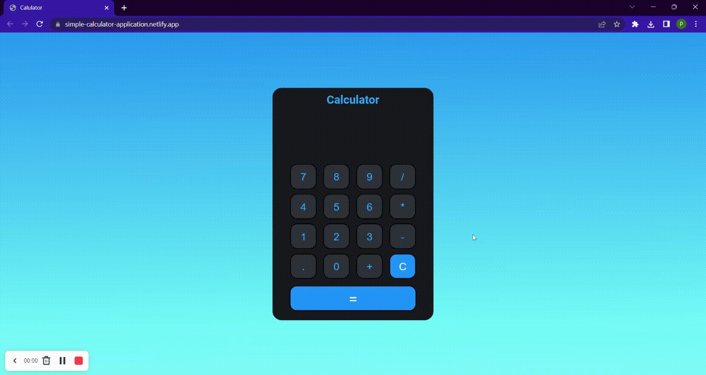

# Calculator App

### Project created through HTML, CSS & Javascript.   Does simple arithmetic fuctions like addition, substraction, multiplication and division
 
 

# Deployed link

[Calculator App](https://simple-calculator-application.netlify.app/ "project link")

 
 

 
 

## Time taken 
👉 It took 5 hours to complete

